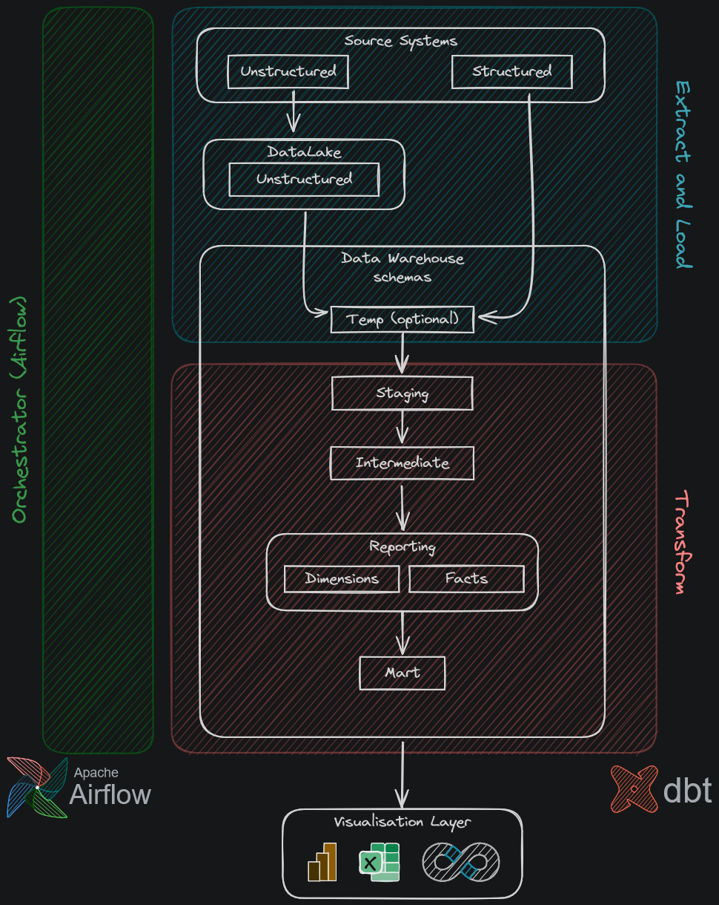

# dw-demo

A demo for a simple data warehouse, intended to demonstrate data warehouse architecture,
project structure, and developer workflow.

This is a work in progress, so far I've managed to:

- Extract and load dummy json data from www.dummyjson.com into local file storage
- Ingest this into a staging table in the duckdb data warehouse

1. Temporary tables
    1. When building SCD2 tables you will want to load the current snapshot
        into a TEMP table
    1. These are tables that are automatically dropped at the end of your
        current session
    1. As long as the temp table exists until the SCD2 is populated, it's
        then safe to drop afterwards
1. Staging (`stg.[source]__[entity]s` e.g. `stg.xero__payments`)
1. Intermediate (`int.source__[entity]s_[verb]` e.g. `int.xero__payments_aggregated_to_user`)
1. Reporting (`rpt.[fct/dim]_[entity]s` e.g. `rpt.fct_payments`)
1. Mart (`mrt.[entity]s` e.g. `mrt.payments`)
    1. This is a fully denormalised schema, joining dim and fct tables together
    1. Where the `rpt` table is useful for BI tools, this is useful for excel exports
        or giving access to analysts with SQL skills

## Running the Project

### System Dependencies

I developed this demo assuming you're on a UNIX OS, if you're on Windows I recommend
    instaling WSL2 and running Docker in WSL2 mode. If you're not using UNIX
    then I don't have much guidance aside from to see if the requirements below
    are available to you.

- Astronomer
- Docker (needs to be running)
- Python version >= 11

### Getting Going

After cloning the repository:

1. Run `make venv` to create a python virtual environment.
1. Run `source .venv/bin/activate` to activate the virtual environment.
    1. This cannot be done from Make as it spawns a shell.
    1. If you're on windows this command will differ since you're not using a shell.
1. Run `make install` to install all developer dependencies.
1. Run `make start` to start the Airflow docker service.

The primary demo I'm working on is the `./dags/dummy_json.py` DAG, I'd recommend
    running this either from the CLI or the web server and then inspecting the results
    in the `./include/data/datawarehouse.db` duckdb file.

This is meant to serve as an example of how to build an Airflow pipeline through the
    several pipeline stages, feel free to build upon what's shown here.

If at any point you run into a permissions issue with Airflow reading a file in the
    `./include/` directory, or modifying it yourself, run `make chmod` which will
    give all users access to read/write/execute within that directory. **WARNING**
    this is not best practice as it applies to any user on your machine.

### Makefile

A makefile is provided for convenience to run common project commands on UNIX systems.

- `make venv` creates python virtual environment
    - You have to source it yourself as Make can't spawn terminals
- `make install` to install dev dependencies
- `make start` to start Airflow docker server
- `make restart` to restart Airflow docker server
- `make stop` to stop Airflow docker server
- `make chmod` for when airflow throws a "cannot access `./include/`" exception
    - This will give **any** users access to read, write, execute the `./include/` directory
